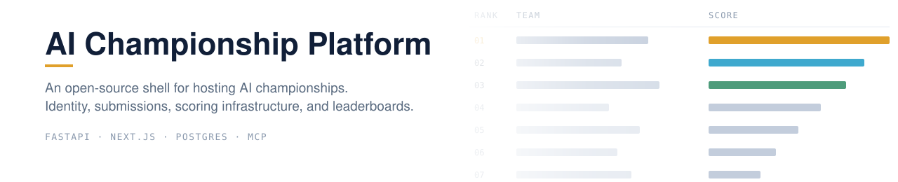
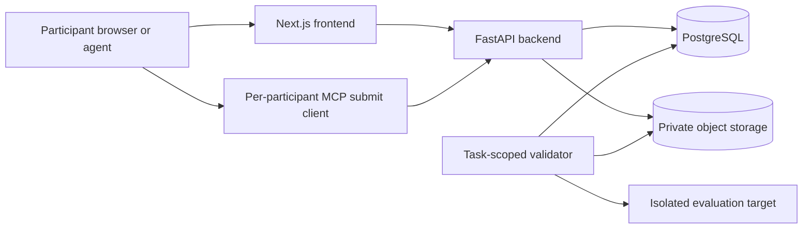

<picture>
  <source media="(prefers-color-scheme: dark)" srcset="docs/assets/banner-dark.svg">
  
</picture>

An open-source shell for running AI competitions. It provides registration,
teams, scheduled task reveal, endpoint and artifact submissions, worker leases,
leaderboards, finals, events, certificates, feedback, and MCP clients.

This repository intentionally contains no competition task implementation,
starter kit, fixture, participant dataset, ground truth, scoring secret, or
event-specific seed data. Operators supply those outside the shell.

## Trust boundaries



The backend is the identity and quota authority. MCP submission tools use the
same authenticated API as the browser and never write directly to the
database. Validators claim only their configured task under expiring leases;
lease fencing prevents a stale worker from publishing a result.

Uploaded code is hostile input. The included validator template does not run
it. A production operator must supply a purpose-built sandbox with no ambient
credentials or internal-network access and strict resource limits. Read the
[security model](docs/security-model.md) before exposing a deployment.

## Components

| Path | Purpose |
|---|---|
| `apps/backend` | FastAPI API, authentication, teams, submissions, quotas, leaderboards, admin flows, and the data-free PostgreSQL schema. |
| `apps/frontend` | Next.js application with configurable branding and generic participant/operator views. |
| `apps/validators` | Task-scoped lease harness, safe endpoint client, bounded test-data loader, metrics, and a fail-closed validator template. |
| `apps/mcp-challenge` | Reveal-gated documentation server. Its `docs/` directory is empty in this repository. |
| `apps/mcp-submit` | Per-participant API client for listing tasks, submitting, and checking results. |

## Local start

Requirements: Docker with Compose, or Python 3.12+, Node 22, pnpm 10,
PostgreSQL 16, and `just`.

```bash
cp .env.example .env
# Replace the two required development values in .env.
docker compose up --build
```

The frontend is served at `http://localhost:3003` and the backend at
`http://localhost:8003`. The database starts with schema only. Create an active
competition and its task metadata before participant testing; do not add real
task data to this repository.

For a non-container workflow:

```bash
just install
just migrate
just dev
```

## Configuration

The local example enables mock authentication explicitly. Production must use
HTTPS, set `ALLOW_MOCK_AUTH=false`, configure Google OIDC and transactional
email, use unique managed secrets, and restrict database and bucket roles.
`SUBMISSION_SECRET_KEY` is a URL-safe base64-encoded 32-byte key used only to
encrypt participant-supplied endpoint credentials.

Branding is configured with `NEXT_PUBLIC_APP_NAME`, `NEXT_PUBLIC_APP_URL`,
`NEXT_PUBLIC_COMPETITION_SLUG`, and `NEXT_PUBLIC_SUPPORT_EMAIL`.

To use the submission MCP client, create a personal access token from an
authenticated browser session through `POST /auth/tokens`, then run one client
instance for that participant with `PLATFORM_API_URL` and
`PLATFORM_ACCESS_TOKEN`. Never operate a shared multi-user MCP instance with a
participant token.

## Documentation

- [Operator guide](docs/operator-guide.md)
- [Task author guide](docs/task-author-guide.md)
- [Security model](docs/security-model.md)
- [Release checklist](RELEASE_CHECKLIST.md)
- [Security reporting](SECURITY.md)

## License

Apache-2.0. See [LICENSE](LICENSE) and [NOTICE](NOTICE).
